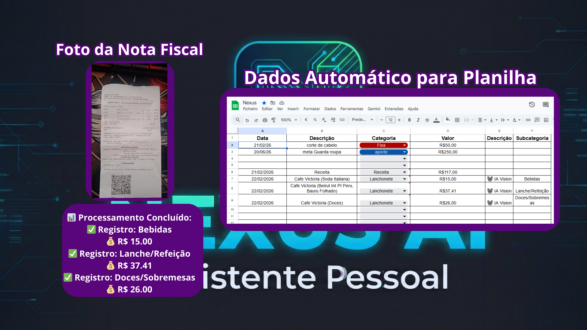
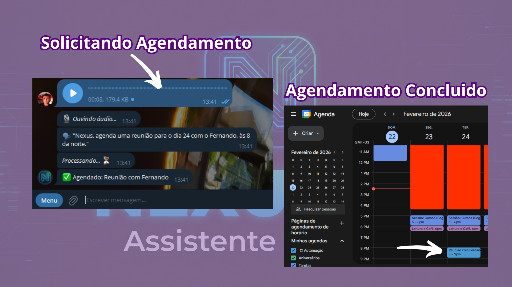
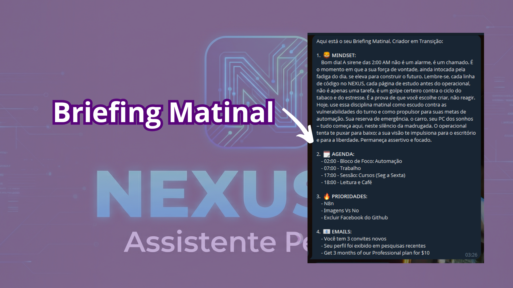

  
  

  # 🤖 Nexus AI - Assistente Executivo e Segundo Cérebro
  
  **O Nexus é um bot de Telegram Serverless que utiliza o ecossistema Google Workspace e a IA multimodal do Gemini 2.5 para automatizar finanças, tarefas e agenda.**

  
  
  
  

---

## 🚀 O Problema que o Nexus Resolve
A gestão diária de tarefas, controle financeiro e caixa de entrada tomam muito tempo útil. O Nexus foi criado para ser um assistente proativo: basta enviar uma foto de um recibo, um áudio ou um comando rápido no Telegram, e ele orquestra todas as informações diretamente para as planilhas e agendas corretas usando Inteligência Artificial.

## ✨ Funcionalidades em Destaque

### 📊 1. OCR Multimodal e Engenharia de Dados Financeiros
O motor principal (Gemini 2.5 Flash Multimodal) analisa fotos de notas fiscais, agrupa os itens por contexto e gera múltiplas inserções no Google Sheets com alta granularidade, separando itens automaticamente (ex: Bebidas, Lanches, Sobremesas).

  
   
  <i>Exemplo: Leitura de cupom fiscal gerando múltiplas linhas categorizadas (incluindo a Coluna F de Subcategorias).</i>

### 🎯 2. Matriz de Eisenhower (Google Tasks)
Gestão visual de prioridades. O usuário envia uma tarefa e o Nexus exibe um menu interativo no Telegram para classificar a urgência e importância. A tarefa é automaticamente criada na lista correta do Google Tasks (ex: Q1 - Urgente e Importante).

  
   
    <i>Exemplo: Exemplo: Comando "/Tarefa", o usuário escolhe nivel de importância, Digita Titulo e Detalhes e a Tarefa é adicionada no Google Tasks</i>

### 🎙️ 3. Transcrição de Áudio e NLP
O Nexus processa mensagens de voz (`.ogg` do Telegram), converte para Base64 e utiliza a API do Gemini para transcrever e interpretar intenções (agendamentos, insights, anotações).

  
   
<i>Exemplo: Exemplo: Comando "/Tarefa", o usuário escolhe nivel de importância, Digita Titulo e Detalhes e a Tarefa é adicionada no Google Tasks</i>

### 📧 4. Secretário Virtual (Gmail & Calendar)
* **Briefing Matinal:** Puxa eventos do Google Calendar e e-mails não lidos, gerando um resumo executivo por IA no início do dia.
* **Auto-Drafts:** Monitora remetentes VIPs no Gmail e cria rascunhos de resposta automáticos baseados no contexto da mensagem.

  
   
  <i>Exemplo: o <b>Nexus AI</b> Manda os relatórios Matinais contendo Mindset, Agenda do dia, Prioridades do dia e os 3 E-mails mais importantes, respondendo automatico os E-mails cadastrados como VIPS </b></i>

   
---

## ⚙️ Arquitetura do Projeto

* O projeto é totalmente **Serverless**, hospedado no **Google Apps Script**.
* Utiliza um **Webhook** configurado na API do Telegram (`doPost`) para receber os dados em tempo real.
* O roteamento interno de IA decide se o comando invoca a API do Sheets, Calendar, Tasks ou Gmail.

## 🔐 Aviso de Segurança
Por motivos de segurança cibernética, as credenciais originais (`TELEGRAM_TOKEN`, `GEMINI_KEY` e IDs de planilhas) foram substituídas por _placeholders_ neste repositório. Nunca comite chaves de API expostas.

---

  <i>Desenvolvido por Gustavo - Foco em Produtividade e Engenharia de Automação</i>

